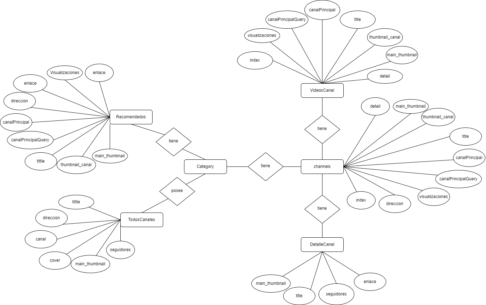

## Índice
- [1. Introducción](#introduccion) 
 																
- [2. Tecnologías escogidas y justificación](#tecnologias_escogidas)  						       	   	  
  - [2.1. Tecnologías FrontEnd](#tecnologias_escogidas_1)
  - [2.1. Tecnologías FrontEnd](#tecnologias_escogidas_2) 
  
- [3. ¿Por qué he elegido este proyecto?](#por_que_elegir)
  - [3.1. ¿Cómo está el mercado respecto a este tipo de proyecto que se desea desarrollar?](#mercado_desarrollo) 
  - [3.2. Objetivo del proyecto](#objetivo)  	
  - [3.3. Planificación](#planificacion)  
  					    		  
- [4. Diseño de la aplicación](#diseno)  										  
  - [4.1. Diagrama de flujo](#casos_uso) 								     	  
  - [4.2. Prototipo de pantallas](#prototipo) 
  - [4.3. Inserción del código](#codigo) 
  			    	  						 
- [5. Implementación y documentación](#implementacion_documentacion)   						         	   		 
  - [5.1. Estructura del proyecto](#estructura)  						         		 
  - [5.2. Recursos externos](#recursos)  	
  - [5.3. Implementación del diseño responsive](#responsive)
   - [5.3.1 Funcionamiento](#funcionamiento)
   		
- [6. Manual de la aplicación](#manual) 
  
- [7. Despliegue de la aplicación](#despliegue)  
 	
- [8. Resultados y discusión](#resultados)   
	
- [9. Conclusiones](#conclusiones)   	
	  									       
<a name="introduccion"></a>						     		
## 1. Introducción 	
La propuesta consiste en el desarrollo de una aplicación web destinado a crear una 
plataforma de videos de forma estática, donde podrás navegar a diferentes sitios y a 
diferentes categorías, con una gran variedad de videos. 
Está pensado para que el usuario conozca contenido que no sabía que iba a ver y que les 
salga contenido relacionado con lo que está viendo, de la misma temática, con lo que es 
importante centrarse en eso, y en que sea lo más interactiva posible.
Esta aplicación se desarrollará en la web, lo que quiere decir que no es necesario instalar 
ningún tipo de software en su equipo informático y con el único requisito de tener un 
acceso a internet y un navegador web.


<a name="tecnologias_escogidas"></a>						     		
## 2. Tecnologías escogidas y justificación

<a name="tecnologias_escogidas_1"></a>
### 2.1 Tecnologias FrontEnd

Son aquellas que se utilizan en el lado Cliente, las que se utilizan en los diferentes dispositivos que utilizamos para conectarnos con el servidor a través de internet. Las tecnologías usadas son:

- HTML5

HTML, siglas de HyperText Markup Language (Lenguaje de Marcas de Hipertexto), es el lenguaje de marcado predominante para la construcción de páginas Web. Es usado para describir la estructura y el contenido en forma de texto, así como para complementar el texto con objetos tales como imágenes. HTML se escribe en formade "etiquetas", rodeadas por corchetes angulares (<,>). HTML también puede describir, hasta un cierto punto, la apariencia de un documento, y puede incluir un script (por ejemplo, JavaScript), el cual puede afectar el comportamiento de navegadores Web y otros procesadores de HTML.HTML también es usado para referirse al contenido del tipo de MIME text/html o todavía más ampliamente como un término genérico para el HTML, ya sea en forma descendida del XML (como XHTML 1.0 y posteriores) o en forma descendida directamente de SGML (como HTML 4.01 y anteriores). Por convención, los archivos de formato HTML usan la extensión .htm o .html

- CSS

HTML, siglas de HyperText Markup Language (Lenguaje de Marcas de Hipertexto), es el lenguaje de marcado predominante para la 
construcción de páginas Web. Es usado para describir la estructura y 
el contenido en forma de texto, así como para complementar el texto 
con objetos tales como imágenes. 
HTML se escribe en formade "etiquetas", rodeadas por corchetes 
angulares (<,>). HTML también puede describir, hasta un cierto punto, la apariencia de un 
documento, y puede incluir un script (por ejemplo, JavaScript), el cual puede afectar el 
comportamiento de navegadores Web y otros procesadores de HTML.
HTML también es usado para referirse al contenido del tipo de MIME text/html o todavía 
más ampliamente como un término genérico para el HTML, ya sea en forma descendida 
del XML (como XHTML 1.0 y posteriores) o en forma descendida directamente de SGML 
(como HTML 4.01 y anteriores). Por convención, los archivos de formato HTML usan la 
extensión .htm o .html


- JQuery

HTML, siglas de HyperText Markup Language (Lenguaje de Marcas 
de Hipertexto), es el lenguaje de marcado predominante para la 
construcción de páginas Web. Es usado para describir la estructura y 
el contenido en forma de texto, así como para complementar el texto 
con objetos tales como imágenes. 
HTML se escribe en formade "etiquetas", rodeadas por corchetes 
angulares (<,>). HTML también puede describir, hasta un cierto punto, la apariencia de un 
documento, y puede incluir un script (por ejemplo, JavaScript), el cual puede afectar el 
comportamiento de navegadores Web y otros procesadores de HTML.
HTML también es usado para referirse al contenido del tipo de MIME text/html o todavía 
más ampliamente como un término genérico para el HTML, ya sea en forma descendida 
del XML (como XHTML 1.0 y posteriores) o en forma descendida directamente de SGML 
(como HTML 4.01 y anteriores). Por convención, los archivos de formato HTML usan la 
extensión .htm o .html

- BxSlider

Permite transición vertical y horizontal. Las diapositivas 
pueden contener imágenes, videos o contenido HTML. 
Advanced touch / golpe soporte incorporado. Utiliza 
transiciones CSS para animación de diapositivas

<a name="tecnologias_escogidas_2"></a>
### 2.1 Tecnologias BackEnd

Son aquellas que se utilizan en el lado Servidor, las que 
utiliza el Servidor para gestionar las diferentes peticiones de información que le 
llegan y para gestionar las bases de datos alojadas en los mismos. Los usados son:

- JavaScript
				 
JavaScript es un lenguaje de programación 
interpretado, es decir, que no requiere
compilación, utilizado principalmente en páginas 
Web, con una sintaxis semejante ala del lenguaje 
Java y el lenguaje C. 
Al igual que Java, JavaScript es un lenguaje 
orientado a objetos propiamente dicho, ya que dispone de Herencia, si bien ésta se realiza 
siguiendo el paradigma de programación basada en prototipos, ya que las nuevas clases 
se generan clonándolas clases base (prototipos) y extendiendo su funcionalidad. 
Todos los navegadores modernos interpretan el código JavaScript integrado dentro de las 
páginas Web. Para interactuar con una página Web se provee al lenguaje JavaScript de 
una implementación del DOM	

- JSON
				 
JSON, que significa JavaScript Object Notation, es 
una formatación usada para estructurar datos en 
forma de texto y transmitirlos de un sistema a otro, 
como en aplicaciones cliente-servidor o en 
aplicaciones móviles.
Una manera de emplearlo es a través de requisiciones AJAX, en que la aplicación 
recupera los datos almacenados en el servidor de hosting sin la necesidad de recargar la 
página.
La especificación del archivo JSON surgió alrededor del año 200, pero solo pasó a formar 
parte del lenguaje JavaScript después del lanzamiento de la versión 5 del ECMAScript.
Actualmente, diversos tipos de lenguaje de programación soportan este formato, además 
de ser una alternativa más liviana que el modelo XML.
				      
- AJAX
				 
AJAX, acrónimo de Asynchronous JavaScript And XML (JavaScript 
asíncrono y XML), es una técnica de desarrollo Web para crear
aplicaciones interactivas oRIA (RichInternet Applications). Estas 
aplicaciones se ejecutan en el cliente, es decir, en el navegador de los 
usuarios mientras se mantiene la comunicación asíncrona con el 
servidor en segundo plano. De esta forma es posible realizar cambios 
sobre las páginas sin necesidad de recargarlas, lo que significa 
aumentar la interactividad, velocidad y usabilidad en las aplicaciones. 
Ajax es una tecnología asíncrona, en el sentido de que los datos 
adicionales se requieren al servidor y se cargan en segundo plano sin interferir con la 
visualización ni el comportamiento de la página. 
JavaScript es el lenguaje interpretado (scripting language) en el que normalmente se 
efectúan las funciones de llamada de Ajax mientras que el acceso a los datos se realiza 
mediante XMLHttpRequest, objeto disponible en los navegadores actuales. En cualquier 
caso, no es necesario que el contenido asíncrono esté formateado en XML. Ajax es una 
técnica válida para múltiples plataformas y utilizable en muchos sistemas operativos y 
navegadores dado que está basado en estándares abiertos como JavaScript y Document 
Object Model (DOM).				      
				      
<a name="por_que_elegir"></a>						     		
## 3. ¿Por qué he elegido este proyecto?	

Llevo pensando desde hace tiempo pensando en hacer una plataforma de videos, y me 
supone un gran reto ya que amplia muchos temas y es muy extenso, también no tiene 
límites para seguir extendiéndolo.


<a name="mercado_desarrollo"></a>
### 3.1 ¿Cómo está el mercado respecto a este tipo de proyecto que se desea desarrollar?

Crear una plataforma de videos es algo que requiere mucho tiempo, tanto para crearse 
como para comprobar de que no se tiene ningún problema, pero he visto ciertos puntos a 
destacar:
	 
• Como bien dije antes, se requiere mucho tiempo por si hay algún problema, pero la 
ventaja de esto es que está disponible las 24 horas y los 365 días del año, lo que 
me permitirá tener mi plataforma de videos permanentemente.
	 
• Ahorro en gastos no implica en incurrir en gastos de licencias de apertura, local 
físico...
	 
• Análisis completo y detalla de los clientes, ya que la analítica web y marketing digital 
permiten profundizar en el análisis del cliente, su comportamiento, gustos y 
preferencias. El fin es localizar los puntos fuertes y los puntos en los que se puede 
mejorar para el contenido y la publicidad añadida en sitios estratégicos
	 
• Anticipación a la competencia, donde la tecnología y el mundo avanza a pasos 
agigantados, es importante estar en continua actualización por lo que cuanto antes 
nos adaptemos a los nuevos cambios mayor ventaja compet	 
	 
<a name="objetivo"></a>
### 3.2 Objetivo del proyecto

La razón de la elaboración de este proyecto viene dada por la necesidad que tienen los 
usuarios de internet de usar su tiempo libre para ver videos, de consultar algún video para 
alguna necesidad que tenga y sobre todo en formato móvil, y al ver que tantas personas 
usan las redes sociales tanto, pues queremos generar interés en nuestro contenido 
desarrollando el diseño móvil y de la web de una forma diferente a la competencia 

<a name="planificacion"></a>
### 3.3 Planificación

A continuación, escribiré todas las historias de usuario empleadas en el proyecto, y el 
proceso que he llevado hasta el producto final:
1. Creación del icono con Canva de HiVideo Sport

2. Implementación de los botones de las redes sociales

3. Añadir el color al header junto con el botón izquierdo del menú

4. Añadir el tamaño, el color y las dimensiones que va a ocupar el sidebar 

5. Creaciones de los botones para las categorías (dentro del sidebar

6. Empleo de JavaScript (clase de css: .smallSidebar) para que el botón que está en el 
header llame al sidebar y si haga más pequeño, y luego que el contenido 
únicamente salga las fotos de cada uno, tapando el texto

7. Crear otra funcion para que cuando se vuelva “pequeño el sidebar”, se vuelva más 
grande el main (clase de css: .largeContainer)

8. Creación de los JSONs que será la información que permitirá pintar todas las 
pantallas

9. Idear una estructura para que cuando cree los renders de pueda “navegar” en base 
a la estructura de carpetas que tenga.

10. Crear un render principal para que me lea los jsons y que cada vez que se cumpla la 
condición [./json/(carpeta padre) /all /0.js] que me los separe en el index.html cada 
vez que entre en una carpeta padre (por la jerarquía establecida), y aparezca el 
nombre de la categoría y sus videos correspondientes 

11. Usare CSS flex para que se acomode a los tamaños de la pantalla, quiero q entren 
4 videos en tamaño pc y también hacer tamaño responsive de ello. 

12. Si me los pinta, luego que se redireccione en la página detalles con su item 
correspondiente (añadiremos un identificador para cada item y se llamara índex)

13. Pintar la página principal correctamente

14. Crear otro render para que me lea los canales del sidebar y que cada vez que se 
cumpla la condición [./json/(carpeta padre) /canales.js] me pinte unos canales u 
otros en funcion de lo que se ponga en la categoría (en la query)

15. Poner un slider con JQuery debido a que la informacion se pinta con este. Usare 
bxslider y estableceré un atributo del cual según pongas una cosa u otra se te 
pintará en el slider

16. Que la informacion no se repita en el slider y en el mosaico que cree

17. Hacer el detalles.html que es la página donde se pintará el video elegido en el 
index.html; copiar la base del header y del sidebar (quiero que cuando estes dentro 
de un video me sigas cargando los canales de la categoría. Ejemplo: 
categoría=baloncesto, y se me pinten todos los de baloncesto aun estando en el 
video).

18. Crear otro render para los detalles. Este a diferencia del otro render que necesite en 
la página principal, este no se recorrería todo, si no que se necesita que se 
seleccione un solo objeto JSON, priorizare el orden de cada json para leerlos uno a 
uno, como empieza a leerlo desde 0 (que sería el primer elemento) lo sincronizaré 
con el atributo nuevo (índex) que añadí a cada objeto JSON.
Todo esto servirá para cuando pongas en la query 
(category=futbol&channel=as&page=0&item=0) se me lea el primer elemento
del JSON, y como en la página principal, para pintar el mosaico, tiene ya un atributo 
llamado (índex) este será el que se pase en la query 
(category=futbol&channel=as&page=0&item=(índex)) 

19. Crear el render que sale los videos recomendados en la parte derecha, pondré 6 
videos aleatorios escogidos de las categorías creadas. Se pondrá en la ruta 
[./json/(carpeta padre) /recomendado.js], se cambiará cada vez que se cambia de 
categoría, y cada vez que se selecciona un item se cargará el render de 
recomendados. Ejemplo: (category=futbol&channel=as&page=0&item=0)

20. Acomodarlo en la pantalla el video juntos con los recomendados y sus títulos 
correspondientes

21. Ahora meter el canal del video junto con su imagen en grande cada vez que se 
cargue un video que aparezca su canal correspondiente [./json/(carpeta padre) 
/(canal)/detalleCanal.js] 

22. Ahora debajo de esto introducir algunos videos del canal, sería más o menos el 
mismo procedimiento que en el anterior paso a diferencia de la ruta que sería esta: 
[./json/(carpeta padre) /(canal)/videosCanal.js]

23. Hacer el tamaño responsive de los detalles

24. Crear el channel.html, sería reusar lo que hemos usado en el header y en el sidebar

25. Ahora lo que pintaremos será el cover, el canal en grande con su nombre y sus 
subscripciones y todos los videos que tenga ese canal. Para ello reusaremos todos 
los renders, ya que tiene una estructura parecida a la de los detalles
		  
<a name="diseno"></a>						     		
## 4. Diseño de la aplicación

<a name="casos_uso"></a>
### 4.1 Diagrama de flujo		
			       


<a name="prototipo"></a>
### 4.2 Prototipo de pantallas	

A continuación, mostraré las tres pantallas que habrá en mi proyecto. Estas serán las 
versiones finales
1. Esta será la página principal


2. Esta será la página de detalles para cuando le des a un video y quieras reproducirlo


3. Este apartado es el canal con todos los videos 

	 

<a name="codigo"></a>
### 4.3 Inserción del código	

```
function renderMosaic() { 
//la función getParameterByName es una función creada para que cuando metas los valores en la query, primero asignes un nombre, luego le tengas que poner un =, para que posteriormente le des un valor al nombre, y segundo para que se les ponga automáticamente, antes del nombre establecido un & para separar una clave de otra. 
    let category = getParameterByName('category'); 
    let channel = getParameterByName('channel'); 
    if (category === 0) {category = 'all';}    //Si no se elige ninguna categoría, las muestra todas 
    if (channel === 0) {channel = 'all';}     //Lo mismo para los canales 
    if (category === 'all') { 
//Ahora cuando se meta en la query category=all, entrara dentro de la condición y pondremos los nombres de las carpetas que tienen la carpeta JSON en el Arrays, esto servirá para que se pinte una imagen distintiva de cada una de las categorías 
        let listadoCategorias = Array('futbol', 'baloncesto', 'tennis', 'rugby', 'beisbol'); 
        crearMosaicosCategorias(listadoCategorias); 
//Es importante poner el nombre exacto de cada carpeta para que con el render categoria se meta dentro de cada una de las carpetas, el canal all y pinte el 0.js 
// let finalUrl = './json/' + category + '/'+channel( está establecido como predeterminado en los parámetros como. channel=all Entonces siempre me cogerá el all) +'/0.js'; 
// Dentro del bucle, en la función, con el html estático pondremos para todos los videos de la página principal con un mismo estilo pero recorriendo el JSON 
        listadoCategorias.forEach(function (categoria) { 
            renderMosaicCategoria(categoria, 'all', categoria); 
        });  } else { 
//Ahora en el caso en el que no estuviésemos en la categoria = all, se cargarían los canales que hay en cada categoría, se recorrería el foreach para leer primero el título, y luego abajo toda la información. Para ello el getCategoryChannels escogerá el logo (main_thumbnail) y el título (title) que está establecido en el canales.js 
        let listadoCanales = getCategoryChannels(category); 
        crearMosaicosCanales(listadoCanales); 
//Luego para recorrer los videos que hay en un canal se recorre el foreach, se llama al renderMosaicCategoria y se representa en la pantalla todos los videos 
        listadoCanales.forEach(function (canal) { 
            renderMosaicCategoria(category, canal.canal, canal.canal);});} 
//debido a los problemas que me ha dado he tenido que recorrerlo después para que me pinte el slider que sale en cada pantalla principal del index.html 
    iniciarSlider();} 
```


```
function insertMosaicItem(index, page, item, category, idMosaic) {
//Esta función está dentro del foreach del renderMosaic para que se pinte la información en la página principal
 let html =
 `<div class="vid-list">`
 //Aquí establezco en el enlace que hará a cada imagen con su ruta, para ello tengo un parámetro llamado item que permitirá sacar la información de los JSON.
 // Para que la redirección sea exitosa, ha sido necesario crear un ID, lo he llamado index. Cuando selecciones un video en la página principal la función sabrá cuál has seleccionado
 + "<a href='detalles.html?category=" + category + "&channel=" + 
item.canalPrincipalQuery + "&page=" + page + "&item=" + item.index + "'>" +
 //Llamamos a la imagen de la misma manera
 `</a>
 <div class="flex-div">
 
 `
 //Este enlace es para el icono del canal que sale en pequeño que permitirá redireccionarse.
 //Dependiendo de la posición de los JSON en el canales.js, gracias al 
item.dirección permitirá redirigirse para que puedas ver a un canal o a otro
 //El funcionamiento del render del channel es distinto porque funciona en base a la posición en el que esta cada canal. Entonces, a cada atributo le añadiré la dirección en base a la posición donde está el canal en el que se quiera hacer referencia
 + "<a href='channel.html?category=" + category + "&channel=" + 
item.canalPrincipalQuery + "&page=" + page + "&item=" + item.direccion + "'>" + 
`
 
 </a> 
 <div class="vid-info">
 <h3 style="color: black">` + item.title + `</h3>
 <h4 style="color: darkgrey">` + item.canalPrincipal + 
`</h4>
 <h4 style="color: darkgrey">` + item.visualizaciones + 
`</h4>
 </div>
 </div>
 </div>`;
 //De esta forma, con el id del html se le llamará y se pintará
 $("#mosaic-" + idMosaic).append(html);}

```

Por la extensión el código aportado al TFG, he puesto el render de la página principal que 
creé donde abarca más línea de código y una de las más complejas debido a las tantas 
situaciones que se tiene que abarcar y a la infomracion que hay que poner

<a name="implementacion_documentacion"></a>						     	
## 5. Implementación y documentación

<a name="estructura"></a>
### 5.1 Estructura del proyecto

La estructura de la aplicación y sus principales carpetas son:
• src: contiene el código fuente de la aplicación
	o css: contiene las hojas de estilos de la aplicación
	o images: contiene las imágenes usadas en la aplicación.
	o js: contiene todos los ficheros JavaScript usados en la aplicación y gran 			parte de la lógica del proyecto
	o json: contiene la informacion que sirve para plasmarlo en la aplicación
		▪ all: es la carpeta donde se tiene que poner toda la información de 
		todos los canales
		▪ baloncesto: muestra los detalles de los canales y videos de baloncesto
		▪ futbol: muestra los detalles de los canales y videos de futbol
		▪ tennis: muestra los detalles de los canales y videos de tennis
		▪ rugby: muestra los detalles de los canales y videos de rugby
		▪ beisbol: muestra los detalles de los canales y videos de beisbol
	o index.html: la página principal que mostrara la “home” de la aplicación
	o detalles.html: es la página que se plasmara cuando se seleccione un video en 
	la aplicación
	o channel.html: es la página que mostrará el canal detallado al que selecciones 
	en la aplicación

<a name="recursos"></a>
### 5.2 Recursos externos

En esta aplicación se han usado diversos recursos externos, es decir, librerías y 
código no escrito por el desarrollador de esta aplicación. Los recursos externos 
usados son:
• JQuery: librería de JavaScript
• Font Awesome: iconos para los elementos del html
• JQuery Bxslider: pinta el slider con toda la información 

<a name="responsive"></a>
### 5.3 Implementación del diseño responsive

El diseño web responsive o adaptativo es una técnica de diseño web que busca la correcta 
visualización de una misma página en distintos dispositivos. Desde ordenadores de 
escritorio a tablets y móviles.
Se trata de redimensionar y colocar los elementos de la web de forma que se adapten al 
ancho de cada dispositivo permitiendo una correcta visualización y una mejor experiencia 
de usuario. Se caracteriza porque los layouts (contenidos) e imágenes son fluidos y se usa 
código media-queries de CSS3.
El diseño responsive permite reducir el tiempo de desarrollo, evita los contenidos 
duplicados, y aumenta la viralidad de los contenidos ya que permite compartirlos de una 
forma mucho más rápida y natural.

<a name="funcionamiento"></a>
#### 5.3.1 Funcionamiento

Para incluir un diseño responsive y el diseño web se ha empleado el uso de CSS flex. 
He usado CSS flex por tres razones:
1. Buen “amoldamiento” que tiene con el contenido: sea en el tamaño que sea, las imágenes, 
el texto... se amolda bien en base al formato que se le da, ya que intenta ocupar todo el 
tamaño los videos en la pantalla, eliminándose la problemática de los espacios en blanco en 
algunos formatos de pantalla.
2. Una de las grandes ventajas que tiene también es su soporte. Casi todos los 
navegadores han implementado la mayoría de las funcionalidades de la 
herramienta. Sin embargo, falta que se integre el 100% de compatibilidad, porque 
hasta el momento soporta el 97,72%.
3. Es fácil de usarlo y entenderlo, no es complejo de entender

**Codigo de ejemplo**

```
.rowVideo{
 display: flex;
 width: 100%;
 flex-direction: column;
 margin-top: 30px;
 margin-left: 20px;
 }
 .col1VideoResponsive {
 width: 100%;
 height: 350px;
 top: 20px;
 justify-content: center;
 display: flex;
 align-items: center;
 margin-top: 10px;
 }
 .col2VideoResponsive {
 margin-top: 150px;
 /* width: 100%; */
 display: flex;
 align-items: center;
 }
 .col1VideoResponsive .video{
 margin-top: 100px;
 width: 100%;
 height: 450px;
 margin-left: -80px;
 }
```

<a name="manual"></a>
### 6 Manual de usuario

• `Header`: Empezando por la izquierda podrás ver un botón para el menú, este menú 
permite que puedas desplegar el sidebar o encogerlo, Dispondrá del icono principal 
de HiVideoSport, que clicando a él se accederá a su página principal, y por último 
sus redes sociales


• `Sidebar`: Se dividirán en dos secciones: están las categorías de los deportes que te 
permitirá acceder a la categoria que seleccionas y a sus videos relacionados con 
este, y los canales recomendados que te salen según en la categoria en la que 
estes


 


• `Main`: A la hora de pasar de página el header y el sidebar es el mismo para todas 
las páginas, a excepción de los canales recomendados, que depender 
indirectamente porque no depende de la página a la que te redirijas, si no a la 
categoria en la que estes situada. Entonces vamos a ver los siguientes ‘main’ que 
dispone los index creados.
o index.html: Primero, en la parte de arriba están las categorías donde tendrás 
un acceso directo a cada una de ellas. Luego, saldrán todos los videos 
clasificados donde accederás a ellos pinchando en las imágenes o a título a 
través del carousel o, más abajo los videos de cada 
canal/categoria(dependiendo donde te encuentres). Por último, si quieres 
acceder al canal del video hay una imagen pequeña donde podrás entrar 
directamente a él y ver todo el contenido que ofrece el canal


• `Detalles.html`: En esta sección se accederá si pinchas a un video del 
index.html. Saldrá el video en grande seleccionado junto con sus videos 
recomendados, también podrás acceder al video y a su canal, y, por último, 
en la parte de abajo, se pintará el canal del video junto con 4 videos de ese 
canal


• `Canal.html`: Por último, saldría un cover del canal seleccionado con sus 
subscripciones, el nombre y todos los videos del canal


<a name="despliegue"></a>
### 7. Despliegue de la aplicación

Para el despliegue he usado Sered.net. Sered es una plataforma que te permite alojar 
dominios para poder desplegar aplicaciones web con el contenido que hayas hecho. 
Para ello he creado un subdominio a partir de un dominio que ya estaba creado para que 
se pueda mostrar la informacion con una url, y no de forma local.
El enlace de mi proyecto es https://hivideo.websparaempresas.net

<a name="resultados"></a>
### 8. Resultados y discusión

El desarrollo de la aplicación en principio se planifico en dos semanas, era complejo, pero 
a medida que pasaba el tiempo se vio que la función que querían implementar en su 
página es más compleja de lo que parece, estimaba que una semana o dos como mucho 
iba a terminar toda la funcionalidad pero fueron más días de lo que se acordó.
Respecto a diseño, lo tenía lo básico, pero no tenía desarrollado el diseño responsive ni 
nada, y claro, al haberlo desarrollado con css Flex, un formato diferente a lo que había 
usado antes, me costó más entenderlo, pero lo pude sacar al final en un mes en vez de 2 
semanas, pero con el objetivo cumplido 
Las mayores dificultades que he visto ha sido sobre todo desarrollar el código, el tener que 
usar JavaScript para que se pinte las imágenes y títulos. Me costó bastante entenderlo 
debido a mi poco conocimiento que tenía con JavaScript. También tuve dificultades con el 
html estático, a la hora de usar los parámetros que pasaba en la funcion para cada html 
estático, el uso de las comillas y crear un parámetro que me pueda permitir sacar los 
JSONs me ha costado bastantes horas por lo poco que sabía de ello. 
El proyecto por cómo se ha desarrollado y por la complejidad que tiene creo que no tiene 
un gran margen de mejora, por la parte del diseño veo que hay que cambiar algo, pero 
únicamente son detalles para pulir. Por la parte del backend si se podría plantear con una 
base de datos, que se puedan crear usuarios, y que esos usuarios puedan subir videos. Es 
el único punto débil que veo a mejorar, pero por la necesidad que tenía la empresa con la 
que estábamos trabajando de tener que navegar por la query y que se leyesen las 
carpetas y su información, lo vería bastante complejo ahora introducir una base de datos. 
Pero si realmente se quiere ampliar, es necesario pensar algo así porque la 
automatización, lo que quiere decir una base de datos, es la clave para que sea un 
producto cada vez más grande, ya que en el caso en el que quieras, simplemente 
implementar un video, es bastante difícil para un usuario que nunca ha visto el proyecto

<a name="conclusiones"></a>
### 9. Conclusiones

Este proyecto me ha ayudado a crecer mucho en un área que no lo tenía tan “fortificado” 
como es java, he aprendido más funcionalidades de JavaScript, el uso del AJAX fuera de 
PHP, ya que no he visto, hasta este trabajo, el uso de esta tecnología y las facilidades que 
te puede llegar a dar, las ventajas que puede tener el html estático... y, sobre todo, lo que 
más destaco, es el uso de los JSONS, son bastantes útiles y más sencillo de lo que parece 
poder usarlo en la página web y es perfecto para este tipo de proyecto.
Lo mejor que saco de este trabajo es que el tiempo, la perfección y el no rendirse es lo 
clave, pero ya no para esto, si no para todo.
Estuve en situaciones de querer abandonar el trabajo y decir de que no podía más, pero 
con paciencia y dedicación, al final todo se saca y la constancia luego te lo recompensa, es 
la esencia de todo


